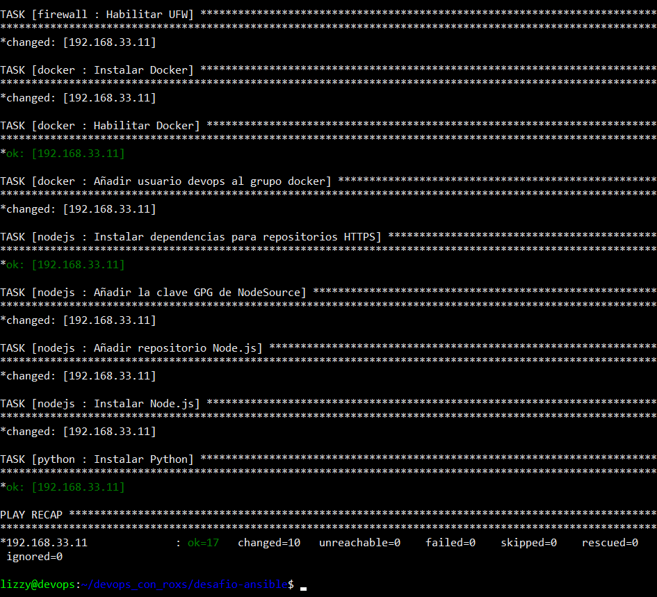

## English Version

- [Haz clic aquí para la versión en Español](docs/README.es.md)

# 🚀 Hands-On DevOps: Ansible Challenge

> Infrastructure Automation with Ansible, Vagrant, and VirtualBox
>
> *Repository based on **Day 6** from the [90 Days of DevOps by Roxs](https://github.com/roxsross/90daysdevopsbyroxs) challenge.*
>
> *→ You can check out my [technical journal](https://github.com/DevLizOps/hands-on-devops-90days-logbook) documenting my process throughout the challenge.*

In this project, I design a **reproducible and modular infrastructure** that automates the creation and configuration of a virtual machine (VM) from scratch, using key DevOps tools: Ansible, Vagrant, and VirtualBox.

> [!NOTE]
> This project is not officially affiliated with Roxs or the original program. It solely reflects my personal knowledge and learning.

## 🧠 Personal Adaptation of the Challenge

Although this project is based on "Day 6" of the [*90 Days of DevOps by Roxs*](https://github.com/roxsross/90daysdevopsbyroxs) challenge, it is not a literal copy. I adapted it to my real development context: a mixed environment where I work with **Windows and WSL2**.

In this scenario, tools like **Ansible** and **VirtualBox** have limitations (Ansible is not compatible with Windows, and VirtualBox does not work properly inside WSL2). To solve this, I split the tasks:

- From **Windows**, I launch the VMs using Vagrant and VirtualBox.
- From **WSL2**, I apply the configuration with Ansible.

Although this is not in the original challenge, it is a common use case in real environments.

> [!WARNING]
> In my mixed environment, the `Vagrantfile` is managed separately (on Windows) from the Ansible files (in WSL), even though both reside in the project root.

## 🤖 Why Ansible?

Ansible is a configuration automation tool that allows defining, versioning, and applying the desired state of infrastructure using YAML files known as *playbooks*. It is **ideal for repeatable tasks** like software installation, service configuration, or user management.

Being **agentless** (no software needed on remote nodes) and using **SSH by default**, it is especially easy to integrate in local environments like this.

> 🔁 This project focuses on automation with Ansible.
>
> If you're more interested in how provisioning works with **Vagrant** and **VirtualBox**, feel free to check out [my previous project](https://github.com/DevLizOps/hands-on-devops-vagrant-shell-provisioning), where I go into detail on how to build reproducible local environments with these tools.
>
> You can also explore the official documentation for [Vagrant](https://developer.hashicorp.com/vagrant) and [VirtualBox](https://www.virtualbox.org/).

---

## 💡 What Does This Project Solve?

It simulates a base server environment automated, useful for development, testing, or lab setups. It achieves:

- Automatic deployment of an **Ubuntu virtual machine**.
- Configuration of an **Nginx server** that serves a **dynamic landing page** generated from a **parameterized Jinja2 template**.
- Preparation of the VM with key tools: **Docker**, **Node.js**, **Python**, **Firewall (UFW)**, and a specialized user for DevOps tasks.

The whole process is **repeatable, configurable, and extensible** thanks to the use of well-organized variables and Ansible roles.

---

## 🛠️ Stack and Tools Used

| Tool           | Purpose                                     |
| -------------- | ------------------------------------------- |
| **Ansible**    | Automates the VM configuration              |
| **Vagrant**    | Manages VM creation                         |
| **VirtualBox** | Virtualizes the machine on Windows          |
| **Jinja2**     | Template engine for dynamic HTML generation |
| **WSL2**       | Linux environment on Windows to run Ansible |

  ```plaintext
            ┌────────────┐
            │  Windows   │
            └─────┬──────┘
                  │ (Vagrant + VirtualBox)
                  ▼
            ┌──────────────┐
            │  Ubuntu VM   │  ⇐ ⇐ ⇐ ⇐ ⇐ ⇐  Configured with Ansible from WSL
            └──────────────┘
                  ▲
                  | (Ansible)
         ┌────────┴────────┐
         │  WSL2 (Ubuntu)  │
         └─────────────────┘
  ```

> If everything runs in the same environment (as the original challenge suggested), you can configure the Vagrantfile to run Ansible automatically after VM creation. Then, a single command `vagrant up` would suffice.

---

## 📁 Project Structure

```plaintext
ansible-challenge/
├── Vagrantfile                        # Defines the VM to create
├── playbook.yml                       # Main Ansible playbook
├── scripts/
├── inventories/
│   └── vagrant/hosts.ini              # Inventory with VM IP
├── group_vars/
│   ├── all/
│   │   ├── html.yml                   # Variables for the landing page
│   │   └── versions.yml               # Node.js and Python versions
│   └── vm/
│       └── vm_config.yml              # VM-specific configuration
│── roles/                             # Ansible roles
│   ├── nginx/                         # Nginx configuration
│   │   ├── tasks/main.yml
│   │   └── templates/index.html.j2    # Jinja2 template
│   ├── devops/                        # devops user with sudo
│   ├── firewall/                      # UFW firewall configuration
│   ├── docker/                        # Docker installation and adding user to docker group
│   ├── nodejs/                        # Node.js installation
│   └── python/                        # Python installation
```

---

## 🔧 Variables and Configuration

Variables are organized to ease scalability. Separating common variables (`all/`) from specific ones (`vm/`) allows using the same roles on different machines without duplicating config.

- **group\_vars/all/**

  - `html.yml`: Landing page title and author.
  - `versions.yml`: Node.js and Python versions.

- **group\_vars/vm/**

  - `vm_config.yml`: VM-specific SSH and IP settings.

> 🛡️ This separation allows differentiating common variables from group-specific ones (here, `vm`).

---

## ⚙️ How to Use

### 1. **Clone the repository**

```bash
git clone https://github.com/DevLizOps/hands-on-devops-ansible-automation.git
cd hands-on-devops-ansible-automation
```

### 2. **Launch the VM**

```bash
vagrant up
```

### 3. **(If needed) Configure Variables**

My mixed WSL-Windows environment forces me to adjust variables in `group_vars/vm/vm_config.yml` every time I launch a new VM.

- The `ansible_host` in my case is obtained from WSL with:

  ```bash
  cat /etc/resolv.conf | grep nameserver
  ```

  Which returns something like:

  ```
  nameserver <WINDOWS_HOST_IP>
  ```

  > This command returns your Windows host IP.

- The `ansible_ssh_private_key_file` requires a private key file with very restrictive permissions. Windows files don’t meet this, so I copied the key provided by Vagrant (found with `vagrant ssh-config` under `IdentityFile`) to a path in WSL (e.g., `~/.ssh/mykey`) and then changed permissions (`chmod 600 ~/.ssh/mykey`). Since I need to do this repeatedly for each VM, I created the `export_vagrant_key.sh` script in `assets/scripts/`. You can run it with:

  ```bash
  bash assets/scripts/export_vagrant_key.sh
  ```

> There are more variables you can customize. Check the whole `group_vars` folder to understand their scope.

### 4. **Apply Configuration with Ansible**

```bash
ansible-playbook -i inventories/vagrant/hosts.ini playbook.yml
```

This runs the Ansible playbook (`playbook.yml`) using the inventory file `hosts.ini`, which contains the target machines’ info (in this case, those created by Vagrant).

An **Ansible playbook** is a YAML file that defines a set of automated tasks to configure systems or deploy apps.

> You can add `-vvv` for verbose output to see detailed configuration application.

Typical output without details looks like:

<table>
  <tr>
    <td align="center"></td>
    <td align="center"></td>
  </tr>
</table>

> [!NOTE]
> This command may fail with a warning like `WARNING: REMOTE HOST IDENTIFICATION HAS CHANGED!` if you recreate the VM after `vagrant destroy`.
>
> This happens because the remote host's public key (the VM) changed from what SSH (and Ansible) had saved in your `~/.ssh/known_hosts`.
>
> In WSL, run:

```bash
ssh-keygen -f ~/.ssh/known_hosts -R '[<ansible_host>]:<ansible_port>' # Replace <ansible_host> and <ansible_port> accordingly.
```

### 5. **Access the VM**

```bash
vagrant ssh
```

### 6. **Verify VM Configuration**

Inside the VM, verify everything with:

```bash
id devops                   # DevOps user with sudo and docker group
sudo ufw status             # UFW firewall status
docker --version            # Docker installed
node --version              # Node.js version
python3 --version           # Python version
systemctl status nginx      # Nginx active (quit with 'q')
curl localhost              # Shows the dynamic landing page
```

Expected output looks like:

<p align="center">
    
</p>

You can also view the landing page by opening the VM IP in your browser (e.g., [192.168.33.11](http://192.168.33.11)).

<p align="center">
    
</p>

### 7. **Cleanup**

When done, exit the VM (`exit`) and remove it:

```bash
vagrant halt && vagrant destroy
```

> [!WARNING]
> `vagrant destroy` completely deletes the VM, so make sure to save anything you want to keep outside the VM.

---

## 🧩 Implemented Bonuses

- ✅ Use of **Jinja2** templates to dynamically customize HTML content via variables.
- ✅ Parameterized variables for easy environment configuration.
- ✅ Script to obtain the VM’s SSH private key in mixed WSL-Windows environments.
- ✅ Additional Ansible roles separated by responsibility.

---

## 🛤️ Roadmap for Improvements

- [ ] Add a second VM acting as a **database**, simulating a real multi-component environment.
- [ ] Configure a private network between Vagrant machines.
- [ ] Integrate **Ansible Vault** for managing sensitive credentials.
- [ ] Add validation tests post-configuration (e.g., Molecule or Testinfra).

---

## 📅 Next Steps

This project is part of my participation in the [90 Days of DevOps by Roxs](https://github.com/roxsross/90daysdevopsbyroxs) challenge.

**Next weekly challenge:**

> Run a real app with multiple components.

👉 Follow my progress and experiments on the [technical journal repository](https://github.com/DevLizOps/hands-on-devops-90days).

---

## ⚠️ About Using This Content

This project is part of my personal learning. You are welcome to **review, get inspired, and learn**, but **out of respect for the original effort, avoid copying it word-for-word or republishing it as your own**.

👉 What matters most is your own approach, mistakes, and learnings.

---

## 📄 License

This repository is under the **MIT License**, allowing free use for personal and educational purposes. See the [LICENSE](LICENSE) file for details.