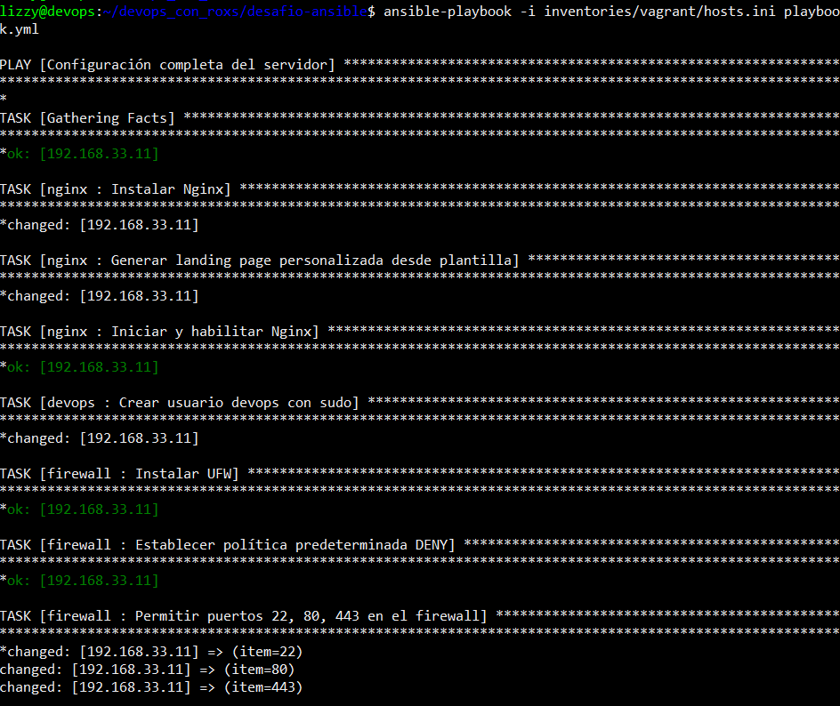
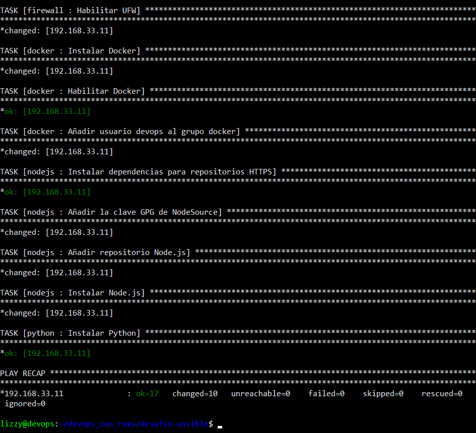
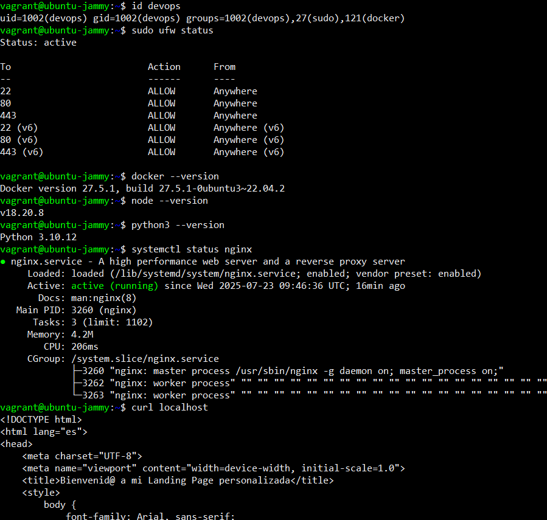
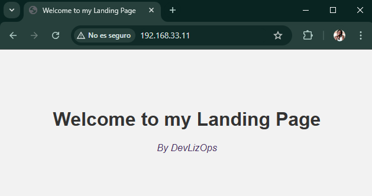

## Versión en Español

- [Click here for the English version](../README.md)

# 🚀 Hands-On DevOps: Desafío Ansible

> Automatización de Infraestructura con Ansible, Vagrant y VirtualBox
>
> *Repositorio basado en el **Día 6** del reto [90 Días de DevOps de Roxs].(https://github.com/roxsross/90daysdevopsbyroxs).*
>
> *→ Puedes ver mi [diario técnico](https://github.com/DevLizOps/hands-on-devops-90days-logbook) donde documento mi proceso a lo largo del reto.*

En este proyecto, diseño una **infraestructura reproducible y modular** que automatiza la creación y configuración de una máquina virtual (VM) desde cero, utilizando herramientas clave del mundo DevOps: Ansible, Vagrant y VirtualBox.

> [!NOTE]
> Este proyecto no está afiliado oficialmente a Roxs ni al programa original. Solo refleja mis conocimientos y aprendizaje.

## 🧠 Adaptación personal del desafío

Aunque este proyecto parte del "Día 6" del reto [*90 Días de DevOps con Roxs*](https://github.com/roxsross/90daysdevopsbyroxs), no lo replica literalmente. Lo he adaptado a mi contexto real de desarrollo: un entorno mixto donde trabajo con **Windows y WSL2**.

En este escenario, herramientas como **Ansible** y **VirtualBox** presentan limitaciones (Ansible no es compatible con Windows, y VirtualBox no funciona correctamente dentro de WSL2). Para solucionarlo, divido las tareas:

- Desde **Windows**, levanto las máquinas con Vagrant y VirtualBox.
- Desde **WSL2**, aplico la configuración con Ansible.

Aunque no está en el reto original, es un caso habitual en entornos reales.

> [!WARNING]
> En mi entorno mixto, el `Vagrantfile` se gestiona por separado (en Windows) del resto de archivos Ansible (en WSL), aunque esté en la raíz del proyecto.

## 🤖 ¿Por qué Ansible?

Ansible es una herramienta de automatización de configuración que permite definir, versionar y aplicar el estado deseado de una infraestructura mediante archivos YAML conocidos como *playbooks*. Es **idóneo para tareas repetibles** como la instalación de software, la configuración de servicios o la gestión de usuarios.

Al ser **agentless** (no necesita instalar nada en los nodos remotos) y utilizar **SSH por defecto**, es especialmente sencillo de integrar en entornos locales como este.

> 🔁 Este proyecto se centra en la automatización con Ansible.
> 
> Si te interesa entender mejor la parte de provisión con **Vagrant** y **VirtualBox**, puedes consultar [mi proyecto anterior](https://github.com/DevLizOps/hands-on-devops-vagrant-shell-provisioning), donde explico en detalle cómo levantar entornos locales reproducibles con estas herramientas.
>
> También puedes visitar los sitios oficiales de [Vagrant](https://developer.hashicorp.com/vagrant) y [VirtualBox](https://www.virtualbox.org/) para más información.

---

## 💡 ¿Qué resuelve este proyecto?

Simula un entorno de servidor base automatizado, útil para entornos de desarrollo, pruebas o laboratorio. Consigue:

- Desplegar automáticamente una **máquina virtual Ubuntu**.
- Configurarla con un **servidor Nginx** que muestra una **landing page dinámica**, generada a partir de una **plantilla Jinja2** parametrizada.
- Preparar la VM con herramientas clave: **Docker**, **Node.js**, **Python**, **Firewall (UFW)** y un usuario especializado para tareas DevOps.

Todo el proceso es **repetible, configurable y extensible** gracias al uso de variables organizadas y roles Ansible.

---

## 🛠️ Stack y herramientas utilizadas

| Herramienta    | Uso                                                |
| -------------- | -------------------------------------------------  |
| **Ansible**    | Automatiza la configuración de la VM               |
| **Vagrant**    | Gestiona la creación de la VM                      |
| **VirtualBox** | Virtualización de la máquina en Windows            |
| **Jinja2**     | Plantilla para generar el HTML dinámico            |
| **WSL2**       | Entorno Linux sobre Windows para ejecutar Ansible  |

  ```plaintext
              ┌────────────┐
              │   Windows  │
              └─────┬──────┘
                    │ (Vagrant + VirtualBox)
                    ▼
              ┌──────────────┐
              │  Ubuntu VM   │  ⇐ ⇐ ⇐ ⇐ ⇐ ⇐  Configurada con Ansible desde WSL
              └──────────────┘
                    ▲
                    | (Ansible)
           ┌────────┴────────┐
           │  WSL2 (Ubuntu)  │
           └─────────────────┘
  ```

> Si todo se ejecuta en el mismo entorno (como proponía el reto oficial originalmente), puedes configurar el Vagrantfile para que Ansible se ejecute automáticamente tras levantar la VM. Así bastaría con un solo comando: `vagrant up`.

---

## 📁 Estructura del proyecto

```plaintext
desafio-ansible/
├── Vagrantfile                         # Define la VM a crear
├── playbook.yml                        # Playbook Ansible principal
├── scripts/
├── inventories/
│   └── vagrant/hosts.ini               # Inventario con la IP de la VM
├── group_vars/
│   ├── all/
│   │   ├── html.yml                    # Variables para la landing page
│   │   └── versions.yml                # Versiones de Node.js y Python
│   └── vm/
│       └── vm_config.yml               # Configuración específica de la VM
│── roles/                              # Roles de Ansible
│   ├── nginx/                          # Configuración de Nginx
│   │   ├── tasks/main.yml
│   │   └── templates/index.html.j2     # Plantilla Jinja2
│   ├── devops/                         # Usuario devops con sudo
│   ├── firewall/                       # Configuración del firewall UFW
│   ├── docker/                         # Instalación de Docker y adición al grupo del usuario devops
│   ├── nodejs/                         # Instalación de Node.js
│   └── python/                         # Instalación de Python
```

---

## 🔧 Variables y configuración

Las variables están organizadas para facilitar la escalabilidad del proyecto. Separar las variables comunes (`all/`) de las específicas (`vm/`) permite aplicar los mismos roles en distintas máquinas sin duplicar la configuración.

- **group\_vars/all/**

  - `html.yml`: título y autor de la landing page.
  - `versions.yml`: versiones de Node.js y Python.

- **group\_vars/vm/**

  - `vm_config.yml`: configuración específica SSH e IP de la VM.

> 🛡️ Esto permite diferenciar variables comunes para todos los grupos de máquinas y otras específicas para cada grupo (en este caso `vm`).

---

## ⚙️ Uso del proyecto

### 1. **Clona el repositorio**

```bash
git clone https://github.com/DevLizOps/hands-on-devops-ansible-automation.git
cd hands-on-devops-ansible-automation
```

### 2. **Levantar la VM**

```bash
vagrant up
```

### 3. **(Si es necesario) Configurar las variables**

Mi entorno mixto (WSL-Windowa) me obliga a usar variables diferentes de las ya proporcionadas en `group_vars/vm/vm_config.yml` cada vez que levanto una nueva VM.

- El `ansible_host` en mi caso lo obtuve desde WSL con el comando:

  ```bash
  cat /etc/resolv.conf | grep nameserver
  ```

  Esto devolverá algo como:

  ```
  nameserver <IP_HOST_WINDOWS>
  ```

  > Este comando devuelve la IP de tu host Windows.

- El `ansible_ssh_private_key_file` requiere un archivo de clave con permisos muy restrictivos. En Windows los archivos no cumplen esta condición, así que copié la clave proporcionada por Vagrant (la puedes sacar con el comando `vagrant ssh-config` > `IdentityFile`) a una ruta en mi WSL (por ejemplo, `~/.ssh/miclave`) y luego le cambié los permisos (`chmod 600 ~/.ssh/miclave`). Como es una tarea repetitiva en mi entorno, ya que tengo que modificar la clave cada vez que levanto o uso una máquina diferente, he configurado el script `export_vagrant_key.sh`, disponible en la carpeta `assets/scripts/`. Puedes ejecutarlo con:

  ```bash
  bash assets/scripts/export_vagrant_key.sh
  ```

> Hay más variables que puedes personalizar. Revisa toda la carpeta `group_vars` para entender su alcance.

### 4. **Aplicar la configuración con Ansible**

```bash
ansible-playbook -i inventories/vagrant/hosts.ini playbook.yml
```

Este comando ejecuta el playbook de Ansible (`playbook.yml`) usando el archivo de inventario `hosts.ini`, que contiene la información de las máquinas a las que se conectará (en este caso, las creadas con Vagrant).

Un **playbook** en Ansible es un archivo YAML que define una serie de tareas automatizadas para configurar sistemas o desplegar aplicaciones.

> Puedes añadirle la opción `-vvv` para ver la aplicación de configuración con más detalle.

La salida sin detalles dará algo así:

<table>
  <tr>
    <td align="center"></td>
    <td align="center"></td>
  </tr>
</table>

> [!NOTE]
> Este comando puede dar error (error: `WARNING: REMOTE HOST IDENTIFICATION HAS CHANGED!`) si recreas la VM con Vagrant después del `vagrant destroy`.
>
> Esto sucede porque la clave pública del host remoto (la VM) ha cambiado respecto a la que Ansible (o SSH) tenía registrada anteriormente en tu archivo `~/.ssh/known_hosts`.
>
> Ejecuta desde WSL:

   ```bash
   ssh-keygen -f ~/.ssh/known_hosts -R '[<ansible_host>]:<ansible_port>' # Cambia <ansible_host> y <ansible_port> por tus variables.
   ```

### 5. **Acceder a la VM**

```bash
vagrant ssh
```

### 6. **Verificar la configuración de la VM**

Desde la máquina virtual, puedes verificar que todo ha sido configurado correctamente con los siguientes comandos:

```bash
id devops                   # Usuario devops con privilegios sudo y añadido al grupo docker
sudo ufw status             # Estado del firewall UFW
docker --version            # Docker instalado
node --version              # Node.js en la versión esperada
python3 --version           # Python en la versión definida
systemctl status nginx      # Nginx activo (se sale con 'q')
curl localhost              # Muestra la landing page dinámica
```

La salida debe darte algo así:

<p align="center">
    
</p>

También puedes ver la landing page generada introduciendo en el navegador la IP de tu VM, [192.168.33.11](http://192.168.33.11) en nuestro caso.

<p align="center">
    
</p>

### 7. **Limpieza del entorno**

Una vez hemos terminado, podemos salir de la máquina virtual con el comando `exit` y eliminar la máquina:

```bash
vagrant halt && vagrant destroy
```

> [!WARNING]
> Ten en cuenta que `vagrant destroy` elimina por completo la VM, así que asegúrate de haber guardado fuera de la VM lo que no quieras perder.

---

## 🧩 Bonus implementados

- ✅ Uso de plantilla **Jinja2** para personalizar el contenido HTML dinámicamente vía variables.
- ✅ Variables parametrizadas para que el entorno sea fácilmente configurable.
- ✅ Script para obtener la clave privada SSH de la VM en entornos mixtos WSL-Windows.
- ✅ Añadidos más roles de Ansible separados por responsabilidad.

---

## 🛤️ Roadmap de posibles mejoras

- [ ] Añadir una segunda VM que actúe como **base de datos**, simulando un entorno real multi-componente.
- [ ] Configurar una red privada entre máquinas en Vagrant.
- [ ] Integrar **Ansible Vault** para manejar credenciales sensibles.
- [ ] Incorporar pruebas de validación tras la configuración (por ejemplo con Molecule o Testinfra).

---

## 📅 Próximos pasos

Este proyecto es parte de mi participación en el reto [90 Días de DevOps de Roxs](https://github.com/roxsross/90daysdevopsbyroxs).

**Próximo desafío semanal:**
> Ejecutar una app real con múltiples componentes."

👉 No te pierdas mi progreso y experimentos en el repositorio de [mi diario técnico del reto](https://github.com/DevLizOps/hands-on-devops-90days).

---

## ⚠️ Sobre el uso de este contenido

Este proyecto es parte de mi aprendizaje personal. Estás invitado/a a **consultarlo, inspirarte y aprender**, pero **por respeto al esfuerzo original, evita copiarlo palabra por palabra o republicarlo como propio**.

👉 Lo que más valor tiene es tu propio enfoque, errores y aprendizajes.

---

## 📄 Licencia

Este repositorio está bajo la licencia **MIT**, que permite su uso libre para fines personales y educativos. Consulta el archivo [LICENSE](LICENSE) para más detalles.